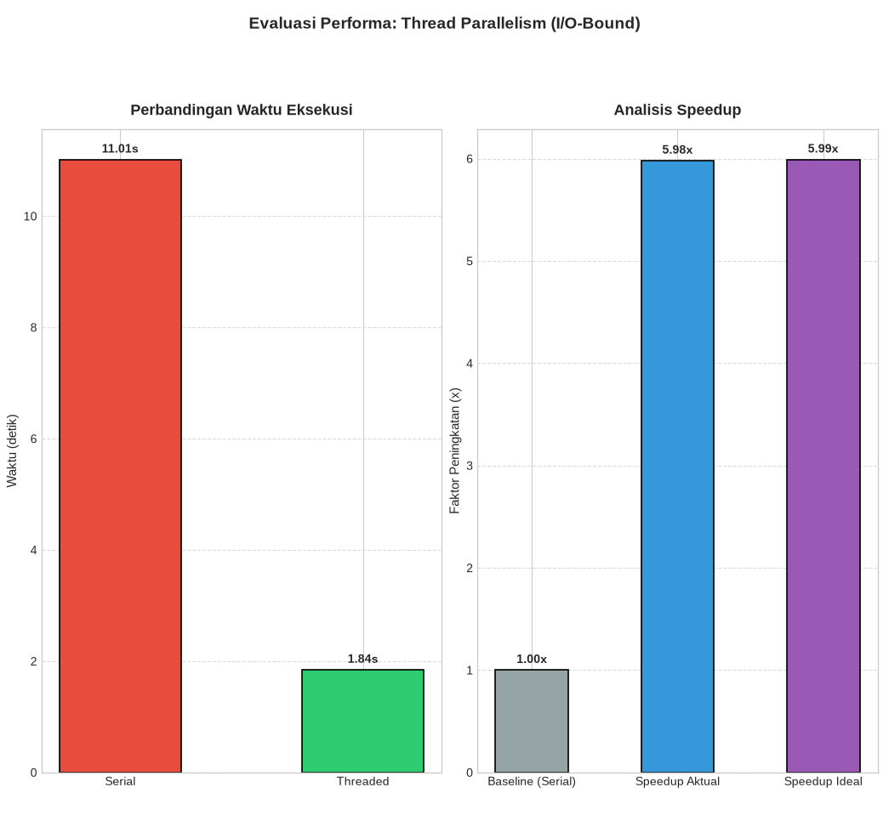

# Praktikum 1 — Thread Parallelism (I/O-Bound Simulation)

Dokumentasi praktikum modul 1 mengenai penerapan **Thread Parallelism** pada beban kerja berbasis I/O (*Input/Output*) menggunakan Python.

---

## Identitas Mahasiswa

- **Nama**: Raka Restu Saputra
- **NPM**: 247006111172
- **Kelas**: F
- **Mata Kuliah**: Komputasi Paralel dan Terdistribusi

---

## Konteks & Tujuan Praktikum

1. **Simulasi Beban I/O**: Mensimulasikan operasi I/O (seperti pengunduhan file atau pemanggilan jaringan) menggunakan jeda waktu acak (`time.sleep`) berdurasi antara 0.5 hingga 2.0 detik untuk 10 file.
2. **Sinkronisasi & Thread-Safety**: Menggunakan `threading.Lock()` untuk mencegah *interleaved logging* (tumpang tindih teks log di terminal) ketika banyak thread menulis pesan log secara bersamaan.
3. **Perbandingan Serial vs Threaded**: Mengukur perbedaan waktu eksekusi saat 10 file diunduh satu per satu secara berurutan (*serial*) dibandingkan saat 10 file diunduh secara serentak (*multithreading*).
4. **Analisis Speedup**:
   - **Speedup Aktual**: $S_{\text{aktual}} = \frac{T_{\text{serial}}}{T_{\text{threaded}}}$
   - **Speedup Ideal**: $S_{\text{ideal}} = \frac{\sum \text{durasi file}}{\max(\text{durasi file})}$
   - **Efisiensi**: $E = \left(\frac{S_{\text{aktual}}}{S_{\text{ideal}}}\right) \times 100\%$

---

## Struktur File

```text
practice-1/
├── README.md               # Dokumentasi modul Praktikum 1
├── results.png             # Tangkapan layar / visualisasi grafik hasil benchmark
└── thread-parallelism.py   # Skrip utama simulasi thread parallelism
```

---

## Kebutuhan Sistem & Library

- Python 3.10+
- Modul standar: `threading`, `time`, `random`
- Library visualisasi: `matplotlib` (install melalui `pip install -r ../requirements.txt` atau `pip install matplotlib`)

---

## Cara Menjalankan Skrip

Pastikan berada di direktori modul atau panggil dari root workspace:

```bash
# Opsi 1: Dari dalam folder practice-1
cd practice-1
python3 thread-parallelism.py

# Opsi 2: Dari root workspace
python3 practice-1/thread-parallelism.py
```

---

## Hasil & Visualisasi Grafik

Setelah eksekusi benchmark selesai, skrip menampilkan **Figure Window Matplotlib** dengan 2 grafik:
1. **Grafik 1 (Kiri)**: Bar chart perbandingan waktu eksekusi total antara mode *Serial* dan *Threaded* dalam satuan detik.
2. **Grafik 2 (Kanan)**: Bar chart analisis percepatan (*speedup*) yang membandingkan nilai *Baseline (1.0x)*, *Speedup Aktual*, dan *Speedup Ideal*.


