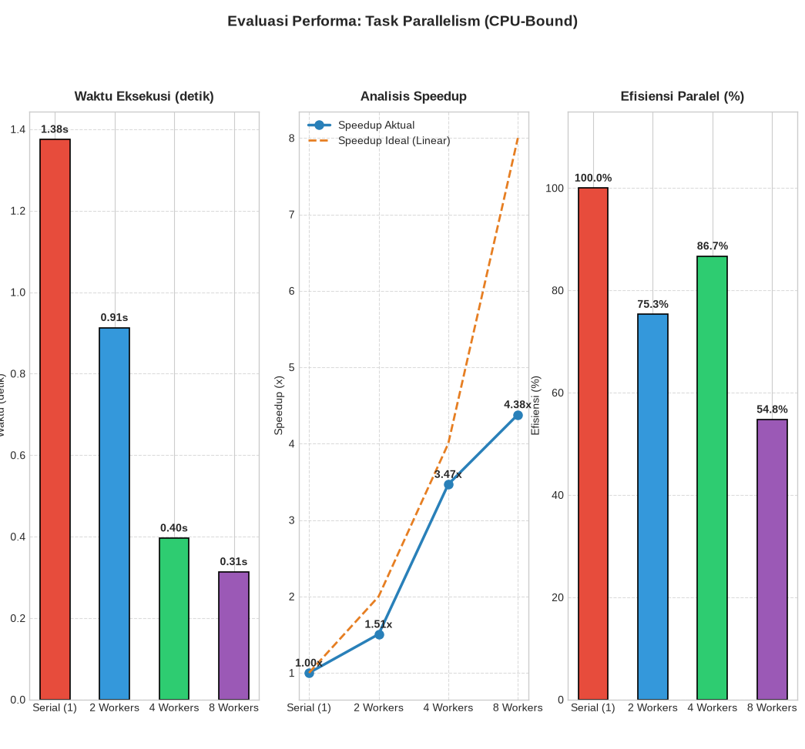

# Praktikum 2 — Task Parallelism (CPU-Bound Heavy Computation)

Dokumentasi praktikum modul 2 mengenai penerapan **Task Parallelism** pada beban kerja komputasi berat (*CPU-Bound*) menggunakan multi-proses (*multiprocessing*) di Python.

---

## Identitas Mahasiswa

- **Nama**: Raka Restu Saputra
- **NPM**: 247006111172
- **Kelas**: F
- **Mata Kuliah**: Komputasi Paralel dan Terdistribusi

---

## Konteks & Tujuan Praktikum

1. **Simulasi Beban CPU-Bound**: Menjalankan fungsi komputasi intensif matematika (akumulasi perulangan modular aritmatika sebanyak $10^6$ iterasi) pada 8 data task numerik.
2. **Implementasi Multiprocessing**: Menggunakan `concurrent.futures.ProcessPoolExecutor` untuk mendistribusikan task komputasi ke inti prosesor (*CPU cores*) terpisah sehingga berjalan paralel tanpa terhalang GIL (*Global Interpreter Lock*).
3. **Analisis Skalabilitas Worker**: Menguji performa sistem dengan variasi jumlah worker proses:
   - Serial (1 Worker)
   - 2 Worker Proses
   - 4 Worker Proses
   - 8 Worker Proses
4. **Metrik Evaluasi Performa**:
   - **Speedup**: $S = \frac{T_{\text{serial}}}{T_{\text{paralel}}}$
   - **Parallel Efficiency**: $E = \frac{S}{\text{Jumlah Worker}} \times 100\%$

---

## Struktur File

```text
practice-2/
├── README.md             # Dokumentasi modul Praktikum 2
├── results.png           # Tangkapan layar / visualisasi grafik hasil benchmark
└── task-parallelism.py   # Skrip utama task parallelism dengan ProcessPoolExecutor
```

---

## Kebutuhan Sistem & Library

- Python 3.10+
- Modul standar: `sys`, `time`, `concurrent.futures`
- Library visualisasi: `matplotlib` (install melalui `pip install -r ../requirements.txt` atau `pip install matplotlib`)

---

## Cara Menjalankan Skrip

**Linux / macOS (`python3`):**
```bash
# Opsi 1: Dari dalam folder practice-2
cd practice-2
python3 task-parallelism.py

# Opsi 2: Dari root workspace
python3 task-2-thread-task-parallel/practice-2/task-parallelism.py
```

**Windows (`py`):**
```powershell
# Opsi 1: Dari dalam folder practice-2
cd practice-2
py task-parallelism.py

# Opsi 2: Dari root workspace
py task-2-thread-task-parallel/practice-2/task-parallelism.py
```

---

## Hasil & Visualisasi Grafik

Setelah benchmark selesai, skrip menampilkan **Figure Window Matplotlib** dengan 3 subplot:
1. **Subplot 1 (Waktu Eksekusi)**: Bar chart durasi waktu eksekusi (detik) untuk Serial, 2 Workers, 4 Workers, dan 8 Workers.
2. **Subplot 2 (Analisis Speedup)**: Kurva perbandingan antara *Speedup Aktual* vs *Speedup Ideal (Linear)*.
3. **Subplot 3 (Efisiensi Paralel)**: Bar chart persentase efisiensi utilisasi core prosesor per variasi worker.


