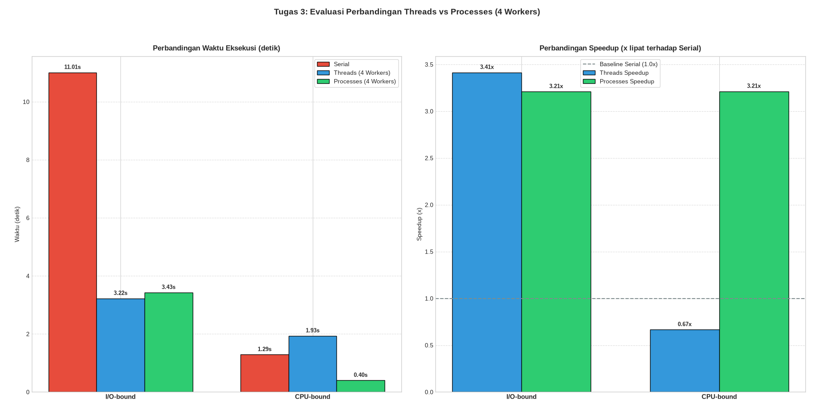

# Praktikum 3 — Perbandingan Threads vs Tasks

Dokumentasi praktikum modul 3 mengenai **analisis komparatif menyeluruh antara Threads (`ThreadPoolExecutor`) dan Tasks (`ProcessPoolExecutor`)** pada beban kerja I/O-Bound dan CPU-Bound di Python.

---

## Identitas Mahasiswa

- **Nama**: Raka Restu Saputra
- **NPM**: 247006111172
- **Kelas**: F
- **Mata Kuliah**: Komputasi Paralel dan Terdistribusi

---

## Konteks & Tujuan Praktikum

1. **Uji Silang Karakteristik Beban Kerja**: Menguji model konkurensi (Serial vs Threads vs Processes dengan 4 Workers) pada:
   - **Beban I/O-Bound**: Simulasi waktu tunggu I/O (`time.sleep` acak).
   - **Beban CPU-Bound**: Komputasi matematika intensif ($10^6$ iterasi per angka).
2. **Memahami Dampak Global Interpreter Lock (GIL)**:
   - Pada **I/O-Bound**, thread melepaskan GIL saat menunggu I/O sehingga *multithreading* berjalan sangat efisien dengan memori ringan.
   - Pada **CPU-Bound**, banyak thread di CPython saling berebut GIL pada satu core CPU, menimbulkan *overhead context switching* yang membuat performa lebih lambat dari serial.
   - Menggunakan `ProcessPoolExecutor` (multi-proses) mengatasi batasan GIL pada beban CPU-bound karena tiap proses memiliki interpreter dan GIL independen.
3. **Penanganan Serialization (Pickle-Safety)**: Menggunakan helper unpacking tingkat atas (`io_task_unpack`) untuk menghindari `_pickle.PicklingError` saat mentransmisikan argumen data antar-proses.

---

## Struktur File

```text
practice-3/
├── README.md                  # Dokumentasi modul Praktikum 3
├── results.png                # Tangkapan layar / visualisasi grafik hasil benchmark
└── compare-threads-tasks.py   # Skrip benchmark komparatif Threads vs Tasks
```

---

## Kebutuhan Sistem & Library

- Python 3.10+
- Modul standar: `time`, `random`, `concurrent.futures`
- Library visualisasi: `matplotlib` (install melalui `pip install -r ../requirements.txt` atau `pip install matplotlib`)

---

## Cara Menjalankan Skrip

```bash
# Opsi 1: Dari dalam folder practice-3
cd practice-3
python3 compare-threads-tasks.py

# Opsi 2: Dari root workspace
python3 practice-3/compare-threads-tasks.py
```

---

## Hasil & Visualisasi Grafik

Setelah benchmark selesai, skrip mencetak tabel komparasi dan menampilkan **Figure Window Matplotlib** dengan 2 subplot:
1. **Subplot 1 (Perbandingan Waktu Eksekusi)**: Bar chart berkelompok yang membandingkan durasi (detik) untuk mode Serial, Threads (4 Workers), dan Processes (4 Workers) pada beban I/O-bound dan CPU-bound.
2. **Subplot 2 (Perbandingan Speedup)**: Bar chart percepatan relatif (*speedup*) terhadap garis referensi *Baseline Serial (1.0x)*.


