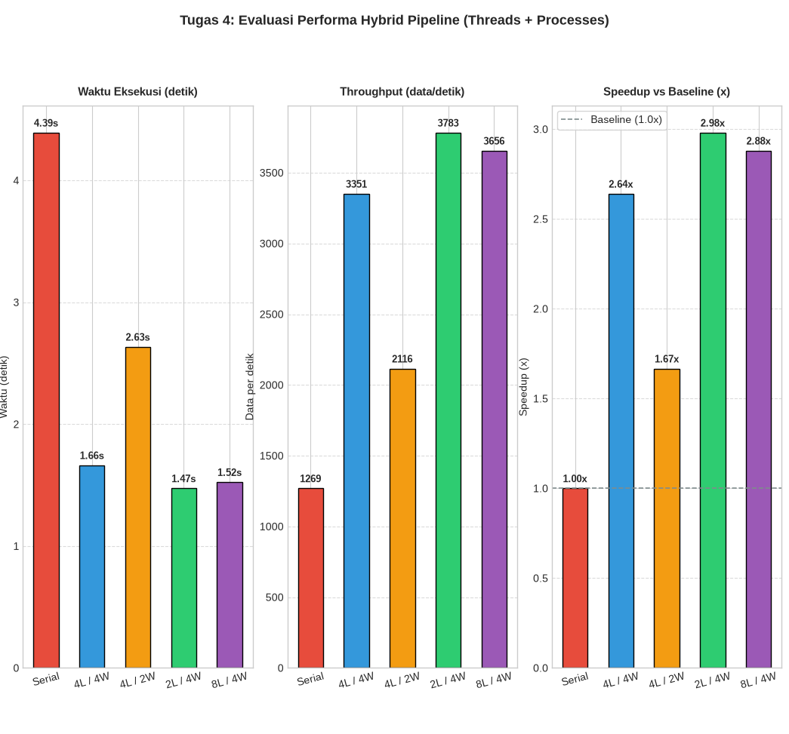

# Praktikum 4 — Hybrid Pipeline (Threads + Processes)

Dokumentasi praktikum modul 4 mengenai arsitektur **Hybrid Pipeline** yang memadukan **I/O Loader Threads** dan **Multi-Process CPU Workers** melalui **Bounded Queue Buffer** untuk memproses dataset nyata SMS Spam (`dataset/train.csv`).

---

## Identitas Mahasiswa

- **Nama**: Raka Restu Saputra
- **NPM**: 247006111172
- **Kelas**: F
- **Mata Kuliah**: Komputasi Paralel dan Terdistribusi

---

## Konteks & Tujuan Praktikum

1. **Arsitektur Pipeline 3-Tahap**:
   - **Stage-1: I/O Loader Threads**: Membaca partisi batch data langsung dari file `dataset/train.csv` secara asinkron/konkuren.
   - **Stage-2: Queue Buffer (`queue.Queue(maxsize=5)`)**: Berfungsi sebagai *thread-safe buffer* penyangga aliran data antara tahap pembacaan dan tahap komputasi agar penggunaan memori terkontrol.
   - **Stage-3: Multi-Process CPU Workers (`ProcessPoolExecutor`)**: Memproses pembersihan teks, tokenisasi, ekstraksi kosakata, dan kalkulasi polynomial hash bobot token pada multi-core CPU.
   - **Aggregator**: Berjalan di main thread untuk mengumpulkan hasil kalkulasi worker, menghitung waktu tunggu (*latency*), dan mengukur laju pemrosesan (*throughput*).
2. **Pengolahan Dataset Nyata Tanpa File Dummy**:
   - Memproses langsung file `dataset/train.csv` (berisi 5.574 baris teks SMS) secara in-memory stream tanpa membuat folder partisi sementara di disk.
3. **Eksplorasi Konfigurasi Sistem**:
   - 4 Loader Threads / 4 CPU Workers
   - 4 Loader Threads / 2 CPU Workers
   - 2 Loader Threads / 4 CPU Workers
   - 8 Loader Threads / 4 CPU Workers
4. **Metrik Evaluasi**:
   - **Throughput**: $\text{Throughput} = \frac{\text{Jumlah Data (SMS)}}{\text{Waktu Eksekusi (s)}}$
   - **Average Latency**: Rata-rata durasi sejak batch dimasukkan ke queue hingga selesai diproses worker.
   - **Speedup**: $S = \frac{T_{\text{baseline}}}{T_{\text{hybrid}}}$

---

## Struktur File

```text
practice-4/
├── README.md               # Dokumentasi modul Praktikum 4
├── dataset/
│   └── train.csv           # Dataset SMS Spam (~5.574 baris data teks)
├── results.png             # Tangkapan layar / visualisasi grafik hasil benchmark
└── hybrid-pipeline.py      # Skrip utama arsitektur hybrid pipeline
```

---

## Kebutuhan Sistem & Library

- Python 3.10+
- Modul standar: `os`, `csv`, `re`, `time`, `queue`, `threading`, `concurrent.futures`
- Library visualisasi: `matplotlib` (install melalui `pip install -r ../requirements.txt` atau `pip install matplotlib`)
- Dataset: `train.csv` (Baris data teks SMS Spam) dari [Kaggle - SMS Spam Collection (Text Classification)](https://www.kaggle.com/datasets/thedevastator/sms-spam-collection-a-more-diverse-dataset)

---

## Cara Menjalankan Skrip

```bash
# Opsi 1: Dari dalam folder practice-4
cd practice-4
python3 hybrid-pipeline.py

# Opsi 2: Dari root workspace
python3 practice-4/hybrid-pipeline.py
```

---

## Hasil & Visualisasi Grafik

Setelah benchmark selesai, skrip mencetak tabel perbandingan throughput, latensi, dan speedup, lalu menampilkan **Figure Window Matplotlib** dengan 3 subplot:
1. **Subplot 1 (Waktu Eksekusi)**: Bar chart durasi (detik) membandingkan Serial Baseline vs berbagai konfigurasi Hybrid (Loaders / Workers).
2. **Subplot 2 (Throughput)**: Bar chart kecepatan pemrosesan (jumlah data SMS per detik).
3. **Subplot 3 (Speedup vs Baseline)**: Bar chart faktor percepatan dengan garis referensi *Baseline (1.0x)*.


